# LangChain AI Assistant

A simple, interactive command-line AI assistant built using the LangChain framework and Google's Gemini API. This project demonstrates core LangChain concepts such as **Chat Models**, **Prompt Templates**, **Output Parsers**, and **LCEL (LangChain Expression Language)**.

## Features

- **Interactive CLI Interface**: Chat continuously in a conversational loop.
- **Multiple Personas**: Switch between different behavior profiles (Teacher, Career Advisor, Code Reviewer) to see how Prompt Templates steer the AI's behavior.
- **Modular Architecture**: Clean separation between configuration (`config.py`), prompt management (`prompts.py`), application logic (`assistant.py`), and user interaction (`main.py`).
- **Environment Management**: Secure API key management via `.env`.

## Prerequisites

Before you begin, ensure you have the following installed:

- Python 3.9+
- A valid Google Gemini API Key

## Installation & Setup

1. **Clone or Download the Repository**
   Ensure you are in the project folder.

2. **Set up a Virtual Environment** (Recommended)

   ```powershell
   python -m venv .venv
   .\.venv\Scripts\Activate.ps1
   ```

3. **Install Dependencies**

   ```powershell
   pip install -r requirements.txt
   ```

4. **Configure your Environment Variables**
   - Rename `.env.example` to `.env` (if you haven't already).
   - Add your API key to the `.env` file:
     ```env
     GEMINI_API_KEY=your_actual_api_key_here
     ```

## Usage

Start the interactive assistant by running:

```powershell
python main.py
```

1. **Select a Persona**: The assistant will prompt you to choose an interaction style (e.g., enter `1` for Teacher).
2. **Chat**: Type your queries.
3. **Exit**: Type `exit` or `quit` when you are done.

## Architecture & Workflow

```mermaid
flowchart TD
    A([User Starts App<br>main.py]) --> B{Select Persona}
    
    B -->|1. Teacher| C[Persona: Teacher]
    B -->|2. Career Advisor| D[Persona: Career Advisor]
    B -->|3. Code Reviewer| E[Persona: Code Reviewer]
    B -->|4. Default| F[Persona: Default]

    C --> G[Initialize Chain<br>assistant.py]
    D --> G
    E --> G
    F --> G

    subgraph Initialization
        G --> H[Load Model<br>config.py]
        H -. ChatGoogleGenerativeAI .-> G
        G --> I[Load Prompt Template<br>prompts.py]
        I -. ChatPromptTemplate .-> G
        G --> J[Build LCEL Chain<br>prompt &#124; model &#124; StrOutputParser]
    end

    J --> K([Accept User Input])

    K --> L[chain.invoke]

    subgraph LCEL Pipeline Flow
        L --> M[1. Format Prompt]
        M --> N[2. Call LLM]
        N --> O[3. Parse Output]
    end

    O --> P([Display AI Response])
    P -. Loop until exit .-> K
```



## Project Structure

```text
.
├── config.py          # Environment variables and Chat Model configuration
├── prompts.py         # Persona-based system messages and ChatPromptTemplates
├── assistant.py       # Core LangChain LCEL Chain logic
├── main.py            # CLI entry point and user interaction loop
├── requirements.txt   # Python dependencies
├── .env               # Secret API keys (ignored by git)
└── .gitignore         # Defines files that Git should ignore
```
## What I learned

This project served as a playground to learn:

- **How to initialize Chat Models** (`ChatGoogleGenerativeAI`).
- **How to use Prompt Templates** to instruct the LLM programmatically without hardcoding strings.
- **How to pipeline operations** efficiently using the `|` syntax in LCEL.

---

_Built as part of the AI Engineering Track (Introduction to LangChain)._
